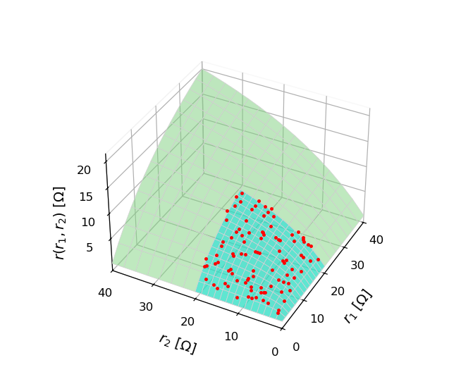
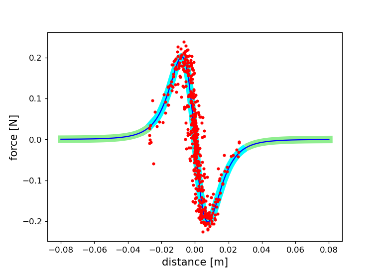
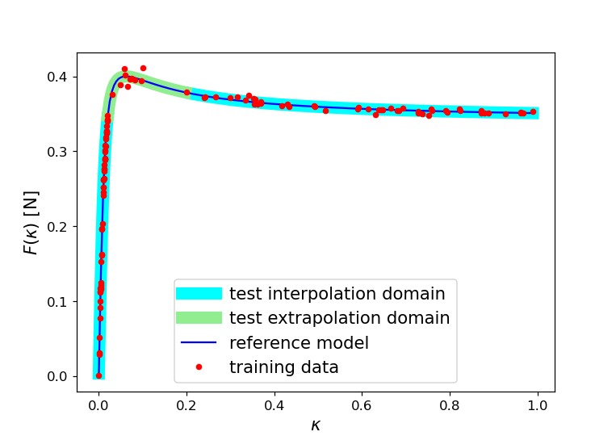

# Experimental Datasets for Symbolic Regression

This repository contains datasets created by the following authors: Jiří Kubalík, Robert Babuška

## Introduction

Symbolic regression is a technique that can automatically derive analytic models from data. Traditionally, symbolic regression has been implemented primarily through genetic programming that evolves populations of candidate solutions sampled by genetic operators, crossover and mutation. More recently, neural networks have been employed to learn the entire analytical model, i.e., its structure and coefficients, using regularized gradient-based optimization.

Recently, neural networks (NN) have been applied to symbolic regression. One of these NN-based approaches represents the analytic models by multilayer feedforward network with heterogeneous units that perform mathematical operations and elementary functions such as {+, -, *, /, sin, exp, etc.}. Network weights are optimized using standard gradient-based algorithms to minimize the training error while significantly reducing the number of active units, i.e., the units that contribute to the output, through regularization. The resulting NN then represents a parsimonious analytic formula. Another class of NN-based approaches is based on training a recurrent neural network (RNN) using reinforcement learning. The idea is to let the RNN generate the equation and then calculate the reward as an error between the groundtruth f(x) values and the values from the predicted function f'(x). A limitation of these approaches is that the model does not generate the constants, which have to be found through nonlinear optimization, slowing down the whole training loop and limiting the achievable accuracy of the model. Recently, transformer-based methods have been applied to symbolic regression that seem to be very promising. After training a transformer on a large number of formulas, the actual inference, i.e., finding a formula for new, unseen data, is very fast (in the order of seconds). This is considerably faster than state-of-the-art evolutionary and standard NN-based methods.

Similarly to other machine learning techniques, methods addressing SR are prone to both overfitting and poor generalization on unseen data. On test data drawn from the same distribution as the training data used for model learning, the models perform very well. However, outside the region of the training data, their accuracy decreases or becomes completely poor. This motivates our effort to develop SR methods that perform well on both interpolation and extrapolation data. Interpolation data refers to samples that fall within the same input space region as the training data, while extrapolation data lies outside this region, testing the model’s ability to generalize beyond observed values. Therefore, the dataset for each test problem is composed of both an interpolation set and an extrapolation set, allowing us to evaluate model performance in both regimes.

These datasets were used in the paper [Neuro-Evolutionary Approach to Physics-Aware Symbolic Regression](https://doi.org/10.1145/3712256.3726434), Genetic and Evolutionary Computation Conference (GECCO ’25), by Jiří Kubalík and Robert Babuška.

```
@inbook{Kubalik2025,
    author = {Kubalik, Jiri and Babuska, Robert},
    title = {Neuro-Evolutionary Approach to Physics-Aware Symbolic Regression},
    year = {2025},
    isbn = {9798400714658},
    publisher = {Association for Computing Machinery},
    address = {New York, NY, USA},
    url = {https://doi.org/10.1145/3712256.3726434},
    booktitle = {Proceedings of the Genetic and Evolutionary Computation Conference},
    pages = {1264–1272},
    numpages = {9}
}
```


## Datasets

**Test problems**

- Datset: ```resistors``` The task is to find a model of the equivalent resistance of two resistors in parallel, $r = r_1 r_2/(r_1 + r_2)$, given noisy training data sampled uniformly from the interpolation domain $D_i = [0.0001, 20]$ Ω. 
The interpolation and extrapolation test data are sampled from the domain $D_i$ and the extrapolation domain $D_e = [20.0001, 40]$, respectively. See the figure below.<br>
Date: 2025-09-05<br>
Author: Jiří Kubalík<br>


- Datset: ```magman``` The magnetic manipulation system consists of an iron ball moving on a rail and an electromagnet placed at a fixed position under the rail. The goal is to find a nonlinear model of the magnetic force, $f(x)$, affecting the ball as a function of the horizontal distance, $x$, between the iron ball and the electromagnet, given a constant current $i$ through the coil. The whole operating region of magman is the interval $D = [−0.075, 0.075]$ m out of which only a small part $D_i = [−0.027, 0.027]$ m is covered by the training data set with 601 samples. These data samples were measured on the real system. The interpolation and extrapolation test data are sampled from the interval $D_i$ and the domain $D_e = D - D_i$, respectively, using an empirical model $f^e(x) = −𝑖 𝑐_1 𝑥/(𝑥^2 + 𝑐_2)^3$. See the figure below.<br>
Date: 2025-09-05<br>
Author: Robert Babuška<br>


- Datset: ```magic formula``` This problem considers the tire-road interaction model, where the longitudinal force $F(\kappa)$ is the following function of the wheel slip𝜅 (aka the ‘magic’ formula): $F(\kappa) = m g d \sin(c \arctan(b(1− e) \kappa + e \arctan(b \kappa)))$, where $b$, $c$, $d$ and $e$ are road surface-specific constants. Here, we consider the reference model with $m = 407.75$ kg, $g = 9.81$ ms $^{−1}$, and the slip force parameters $(b, c, d, e) = (55.56, 1.35, 0.4, 0.52)$. A training data set of 110 samples was generated on the interval $D = [0, 1]$ using the reference model. The data are intentionally sampled unevenly. The whole interval is divided into $D_i = [0, 0.02] ∪ [0.2, 0.99]$ and $D_e = [0.03, 0.1]$, with well-represented $D_i$ and poorly-represented $D_e$. See the figure below.<br>
Date: 2025-09-05<br>
Author: Robert Babuška<br>



**Data format**

- The dataset files are comma-separated CSV files. 
- All columns but the last one represent independent variables; the last column is the predicted value.


<!--
## License

TBD
-->